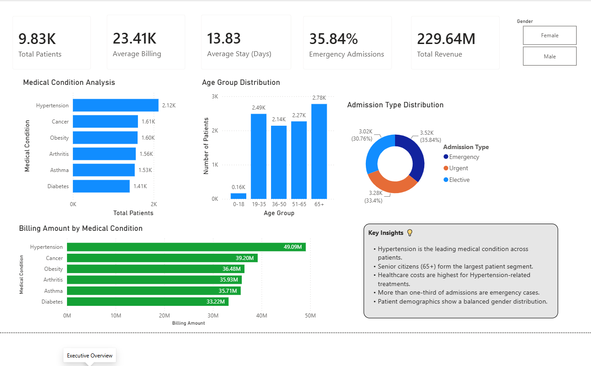
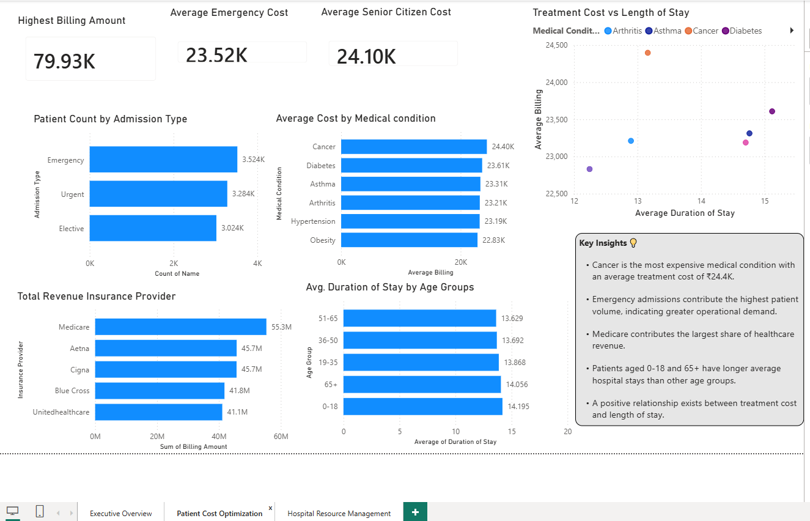
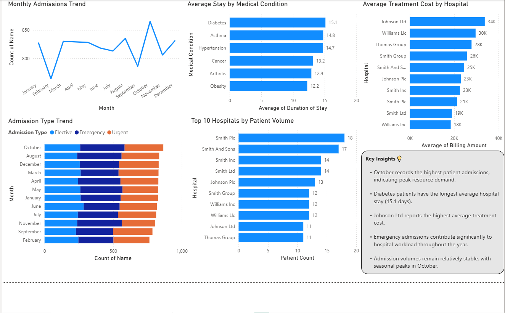

# US Healthcare Analytics Dashboard

## Project Overview

This project analyzes healthcare data using Microsoft Excel and Power BI to understand patient demographics, admission patterns, healthcare costs, hospital performance, and length of stay.

The project contains an interactive Power BI dashboard with three analytical sections:

1. Executive Overview
2. Patient Cost Optimization
3. Hospital Resource Management

## Dataset

The project uses a healthcare dataset containing approximately 10,000 patient records with information related to:

- Patient demographics
- Medical conditions
- Admission and discharge dates
- Hospitals
- Insurance providers
- Admission types
- Billing amounts
- Treatment-related attributes

The raw dataset is **not included in this repository**.

## Tools & Technologies

- Microsoft Excel
- Power BI
- DAX
- Data Cleaning
- Data Transformation
- Data Visualization
- Exploratory Data Analysis
- KPI Reporting

## Data Preparation

The healthcare dataset was cleaned and prepared before analysis.

Key activities included:

- Checking data quality and consistency
- Validating data types
- Reviewing missing and duplicate records
- Preparing date fields for analysis
- Creating calculated fields
- Creating age groups
- Calculating length of hospital stay
- Preparing the dataset for Power BI analysis

## Dashboard Pages

### 1. Executive Overview

The Executive Overview provides a high-level view of healthcare performance.

Key KPIs include:

- Total Patients
- Average Billing
- Average Stay
- Emergency Admissions
- Total Revenue

The dashboard also analyzes:

- Medical condition distribution
- Age group distribution
- Admission type distribution
- Billing amount by medical condition
- Healthcare revenue by insurance provider

### 2. Patient Cost Optimization

This section focuses on healthcare costs and patient-level cost drivers.

Key analysis includes:

- Highest billing amount
- Average emergency cost
- Average senior citizen cost
- Patient count by admission type
- Average cost by medical condition
- Revenue by insurance provider
- Average duration of stay by age group
- Treatment cost versus length of stay

### 3. Hospital Resource Management

This section analyzes hospital activity and resource utilization.

Key analysis includes:

- Monthly admission trends
- Admission type trends
- Average stay by medical condition
- Average treatment cost by hospital
- Top hospitals by patient volume
- Hospital resource demand patterns

## Key Insights

The dashboard highlights the following observations:

- Hypertension is the leading medical condition by patient volume in the Executive Overview.
- October records the highest monthly admission volume in the Hospital Resource Management analysis.
- Emergency admissions account for a significant share of total admissions.
- Diabetes has the longest average hospital stay among the medical conditions shown.
- Cancer has the highest average treatment cost among the medical conditions shown.
- Medicare contributes the largest share of healthcare revenue in the analysis.
- Treatment cost shows a positive relationship with length of hospital stay.
- Patients aged 65+ form one of the largest patient segments.

## Business Value

The dashboard helps identify healthcare cost drivers, admission patterns, patient segments, and hospital resource requirements.

These insights can support:

- Healthcare cost optimization
- Resource planning
- Hospital capacity management
- Admission trend monitoring
- Operational decision-making

## Dashboard Screenshots

### Executive Overview



### Patient Cost Optimization



### Hospital Resource Management



## Repository Structure

```text
us-healthcare-analytics-powerbi/
│
├── README.md
│
├── PowerBI/
│   └── HealthCare_Project.pbix
│
└── Screenshots/
    ├── Executive_Overview.png
    ├── Patient_Cost_Optimization.png
    └── Hospital_Resource_Management.png
